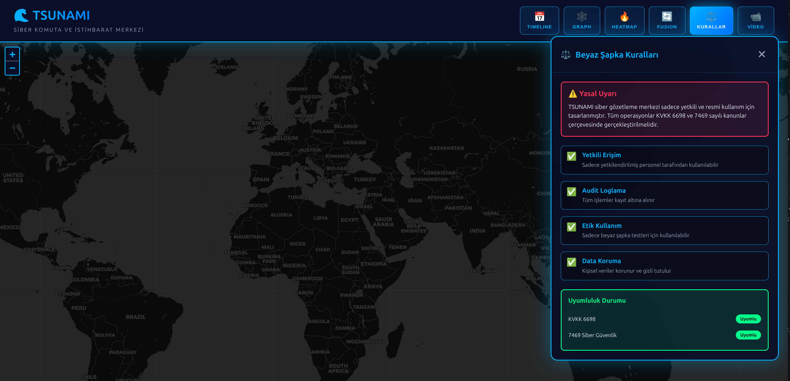

<div align="center">

# 🌊 TSUNAMI

### Advanced Cyber Intelligence & Threat Analysis Platform
### Gelişmiş Siber İstihbarat ve Tehdit Analiz Platformu

[](https://python.org)
[](https://flask.palletsprojects.com)
[](LICENSE)
[](https://github.com/lydianai/tsunami/actions/workflows/ci.yml)
[](https://github.com/lydianai/tsunami/actions/workflows/codeql.yml)
[](https://scorecard.dev/viewer/?uri=github.com/lydianai/tsunami)
[](SECURITY.md)
[](docker-compose.yml)
[](openapi.yaml)
[](LEGAL.md)
[](CONTRIBUTING.md)
[](CODE_OF_CONDUCT.md)

**Real-time cyber intelligence platform with SIGINT/OSINT, threat hunting, AI-powered anomaly detection, and live WebSocket dashboards.**

[English](#english) • [Türkçe](#türkçe) • [Quick Start](#quick-start) • [API Docs](#api-documentation) • [Contributing](CONTRIBUTING.md)

</div>

---

## Screenshot



*TSUNAMI Cyber Command Center — Real-time geolocation map with integrated White-Hat compliance rules panel. All operations are logged and authorized-use-only.*

---

<a name="english"></a>
## 🇬🇧 English

### Overview

TSUNAMI is a production-grade cyber intelligence platform built for **Security Operations Centers (SOCs)**, red teams, and security researchers. It combines network intelligence, OSINT, threat feeds, AI anomaly detection, and real-time monitoring into a single unified platform.

> **White-Hat Only.** All capabilities are designed for authorized security testing, defensive operations, and research purposes only. See [LEGAL.md](LEGAL.md) for mandatory authorization requirements.

### Features

#### 🔍 SIGINT / OSINT Intelligence
- **IP & Domain Analysis** — WHOIS, DNS enumeration, reverse lookups, ASN mapping
- **Username OSINT** — Cross-platform username search (Sherlock, Maigret, social-analyzer)
- **Email Intelligence** — Breach detection, email validation, domain reputation
- **Phone Intelligence** — Carrier lookup, geolocation, number validation
- **Subdomain Discovery** — Subfinder, Sublist3r, DNSRecon, Amass integration
- **Social Media Profiling** — Multi-platform open source intelligence gathering

#### 🛡️ Threat Intelligence
- **Real-Time Threat Feeds** — IOC (Indicator of Compromise) lookup and analysis
- **VirusTotal Integration** — File hash, URL, and domain reputation checks
- **AlienVault OTX** — Open Threat Exchange pulse correlation
- **AbuseIPDB** — IP reputation and abuse reporting
- **Shodan** — IoT device discovery and exposed service detection
- **DEFCON System** — 5-level alert and defense posture management

#### 🗺️ Geolocation & Mapping
- **IP Geolocation** — Precise location mapping with Leaflet/OpenStreetMap
- **Cell Tower Tracking** — OpenCellID integration for tower-based positioning
- **Satellite Correlation** — Multi-source geolocation cross-referencing
- **Real-Time Map Dashboard** — Live threat actor location visualization
- **KVKK & GDPR Compliant** — Privacy-first data handling

#### 🧠 AI & Machine Learning
- **Anomaly Detection** — scikit-learn ML models for behavioral analysis
- **LLM Integration** — Groq LLM for natural language threat queries
- **Graph Neural Network** — Relationship analysis between threat actors, IPs, and TTPs
- **Agentic SOC** — Autonomous security event triage and response recommendations
- **Entropy Analysis** — Shannon entropy calculation for encryption/obfuscation detection
- **Threat Prediction** — Predictive scoring for emerging attack patterns

#### ⚡ Detection & Response
- **Sinkhole System** — Traffic interception and attacker behavioral analysis
- **Honeypot Framework** — Decoy service deployment and interaction logging
- **MITRE ATT&CK Mapping** — Automatic technique classification (all 14 tactics)
- **SOAR/XDR** — Security orchestration and automated response workflows
- **DEFCON Alerting** — Multi-level defense posture escalation
- **Wireless Security** — WiFi network analysis and intrusion detection

#### 🔐 Security Architecture
- **JWT Authentication** — Short-lived access tokens + refresh token rotation
- **Argon2id Hashing** — Memory-hard password hashing (OWASP recommended)
- **Flask-Talisman** — Security headers (HSTS, CSP, X-Frame-Options)
- **Flask-Limiter** — Intelligent rate limiting per endpoint
- **CSRF Protection** — State-changing endpoint protection
- **2FA / TOTP** — Time-based one-time password support
- **Audit Logging** — Comprehensive action and access logging

#### 🚀 Infrastructure
- **WebSocket Dashboard** — Flask-SocketIO real-time monitoring (29+ events)
- **530+ REST Endpoints** — Full RESTful API with Swagger/OpenAPI 3.0 docs
- **Celery Task Queue** — 24/7 autonomous background threat hunting
- **Multi-Database** — SQLite (dev), PostgreSQL (prod), Redis (cache), MongoDB (optional)
- **React Frontend** — Modern SPA with D3.js visualizations and Leaflet maps
- **Docker Ready** — Full stack with Prometheus, Grafana, Nginx

#### 📋 Compliance
- **OWASP Top 10 (2021)** — Full compliance coverage
- **KVKK 6698** — Turkish Personal Data Protection Law compliance
- **7469 Siber Güvenlik** — Turkish Cyber Security Law compliance
- **GDPR** — EU data protection regulation compliance

---

### Quick Start

#### Prerequisites
- Python 3.10+
- Git
- Redis (optional — falls back to in-memory)
- Node.js 18+ (for React frontend)

#### 1. Clone & Setup

```bash
git clone https://github.com/lydianai/tsunami.git
cd tsunami

# Create virtual environment
python3 -m venv venv
source venv/bin/activate  # Windows: venv\Scripts\activate

# Install dependencies
pip install -r requirements.txt
```

#### 2. Configure Environment

```bash
# Copy example config
cp .env.example .env

# Edit .env with your API keys (all optional — platform works without them)
nano .env
```

> **Minimum required:** Only `SECRET_KEY` is required. All API keys are optional — the platform degrades gracefully without them.

#### 3. Run

```bash
# Development server
python3 dalga_web.py
# → http://localhost:8082

# Production server (Gunicorn)
./run_production.sh
# → http://localhost:8080
```

#### 4. React Frontend (optional)

```bash
cd tsunam-react
npm install
npm start
# → http://localhost:3001
```

#### 5. Docker (Full Stack)

```bash
# Full stack: web + redis + prometheus + grafana + nginx
docker-compose up -d

# Services
# TSUNAMI web:  http://localhost:8080
# Grafana:      http://localhost:3000
# Prometheus:   http://localhost:9090
```

---

### Architecture

```
tsunami/
├── dalga_web.py              # Main Flask app (530+ routes, WebSocket)
├── dalga_auth.py             # Authentication & JWT security
├── dalga_beyin.py            # AI brain module (LLM, anomaly detection)
├── dalga_hardening.py        # Security hardening middleware
├── dalga_stealth.py          # Stealth/anonymization layer
├── dalga_security.py         # Core security engine
├── dalga_osint.py            # OSINT intelligence gathering
├── dalga_geo.py              # Geolocation engine
├── dalga_threat_intel.py     # Threat intelligence feeds
├── dalga_gnn.py              # Graph Neural Network analysis
│
├── modules/                  # Feature modules
│   ├── shannon/              # Entropy & encryption analysis
│   ├── sinkhole/             # Traffic sinkhole system
│   ├── honeypot/             # Honeypot framework
│   ├── agentic_soc/          # Autonomous SOC agent
│   ├── mitre_attack/         # MITRE ATT&CK integration
│   ├── soar_xdr/             # SOAR/XDR orchestration
│   ├── threat_intelligence/  # Threat intel aggregation
│   ├── wireless_defense/     # Wireless security analysis
│   ├── quantum_crypto/       # Post-quantum cryptography
│   └── darkweb_intel/        # Dark web monitoring
│
├── routes/                   # Blueprint route handlers
├── config/                   # Service configurations
├── migrations/               # Database migration scripts
├── tests/                    # pytest test suite
├── tsunam-react/             # React SPA frontend
├── docs/screenshots/         # Platform screenshots
├── docker-compose.yml        # Full stack Docker setup
└── run_production.sh         # Gunicorn production launcher
```

### Technology Stack

| Layer | Technology |
|-------|-----------|
| Backend | Python 3.12, Flask 3.1, Flask-SocketIO |
| Authentication | JWT (PyJWT), bcrypt, Argon2id, TOTP |
| Database | SQLite / PostgreSQL + SQLAlchemy 2.0 |
| Cache / Queue | Redis 7, Celery 5 |
| Frontend | React 19, D3.js, Leaflet |
| AI/ML | Groq LLM, scikit-learn, Graph Neural Networks |
| Security | Flask-Talisman, Flask-Limiter, CSRF protection |
| Monitoring | Prometheus, Grafana, Sentry |
| CI/CD | GitHub Actions (CodeQL, Scorecard, SBOM, Docker) |

---

### API Documentation

Swagger/OpenAPI docs: `http://localhost:8082/apidocs`

| Namespace | Description |
|-----------|-------------|
| `/api/auth/` | Authentication, JWT, 2FA |
| `/api/threats/` | Threat intelligence, IOC lookup |
| `/api/osint/` | OSINT queries, IP/domain analysis |
| `/api/geo/` | Geolocation, cell tower mapping |
| `/api/shannon/` | Entropy analysis |
| `/api/sinkhole/` | Traffic sinkhole management |
| `/api/honeypot/` | Honeypot events |
| `/api/mitre/` | ATT&CK technique mapping |
| `/api/ai/` | AI/ML threat prediction |
| `/api/defcon/` | DEFCON level management |

Full documentation: [API_DOCUMENTATION.md](API_DOCUMENTATION.md)

---

### Configuration

All configuration via environment variables. See [`.env.example`](.env.example) for the complete list.

#### Required

| Variable | Description |
|----------|-------------|
| `SECRET_KEY` | Flask secret key — generate with `openssl rand -hex 32` |

#### Optional (enable additional features)

| Variable | Service | Free Tier |
|----------|---------|-----------|
| `SHODAN_API_KEY` | IoT/network device search | ✅ |
| `VIRUSTOTAL_API_KEY` | Malware/IOC analysis | ✅ |
| `OTX_KEY` | AlienVault threat feeds | ✅ |
| `ABUSEIPDB_KEY` | IP reputation | ✅ |
| `GROQ_API_KEY` | LLM queries | ✅ |
| `OPENCELLID_API_KEY` | Cell tower geolocation | ✅ |

---

### Testing

```bash
# Run all tests
python3 -m pytest tests/ -v

# With coverage report
python3 -m pytest tests/ --cov=. --cov-report=html
open htmlcov/index.html

# Security-specific tests
python3 -m pytest tests/test_dalga_auth.py -v
```

---

### Security

This project is designed with security-first principles:

- **OWASP Top 10** compliance (2021)
- **Flask-Talisman** for security headers (HSTS, CSP, X-Frame)
- **Flask-Limiter** for rate limiting
- **Argon2id** password hashing
- **JWT** with short-lived access tokens + refresh tokens
- **CSRF** protection on all state-changing endpoints
- **CodeQL** automated SAST analysis on every push
- **OpenSSF Scorecard** supply chain security verification
- **SBOM** (Software Bill of Materials) attached to every release
- **Pre-commit hooks** with `detect-secrets` and `bandit`
- **Dependency scanning** via `safety` and `pip-audit` in CI

To report a vulnerability, see [SECURITY.md](SECURITY.md).

---

<a name="türkçe"></a>
## 🇹🇷 Türkçe

### Genel Bakış

TSUNAMI, **Güvenlik Operasyon Merkezleri (SOC)**, kırmızı takımlar ve güvenlik araştırmacıları için geliştirilmiş üretim kalitesinde bir siber istihbarat platformudur. Ağ istihbaratı, OSINT, tehdit beslemeleri, yapay zeka tabanlı anomali tespiti ve gerçek zamanlı izlemeyi tek bir birleşik platformda bir araya getirir.

> **Yalnızca Beyaz Şapka.** Tüm özellikler yalnızca yetkili güvenlik testi, savunma operasyonları ve araştırma amaçları için tasarlanmıştır. Zorunlu yetkilendirme gereksinimleri için [LEGAL.md](LEGAL.md) dosyasına bakın.

### Özellikler

#### 🔍 SIGINT / OSINT İstihbarat
- **IP ve Domain Analizi** — WHOIS, DNS sayımı, ters arama, ASN haritalama
- **Kullanıcı Adı OSINT** — Çapraz platform kullanıcı adı arama (Sherlock, Maigret, social-analyzer)
- **E-posta İstihbaratı** — İhlal tespiti, e-posta doğrulama, domain itibarı
- **Telefon İstihbaratı** — Taşıyıcı sorgusu, coğrafi konum, numara doğrulama
- **Alt Domain Keşfi** — Subfinder, Sublist3r, DNSRecon, Amass entegrasyonu
- **Sosyal Medya Profilleme** — Çok platformlu açık kaynak istihbarat toplama

#### 🛡️ Tehdit İstihbaratı
- **Gerçek Zamanlı Tehdit Beslemeleri** — IOC (Uzlaşma Göstergesi) sorgusu ve analizi
- **VirusTotal Entegrasyonu** — Dosya hash, URL ve domain itibar kontrolleri
- **AlienVault OTX** — Açık Tehdit Değişimi nabız korelasyonu
- **AbuseIPDB** — IP itibarı ve kötüye kullanım raporlama
- **Shodan** — IoT cihaz keşfi ve açık servis tespiti
- **DEFCON Sistemi** — 5 seviyeli alarm ve savunma duruşu yönetimi

#### 🗺️ Coğrafi Konum ve Haritalama
- **IP Coğrafi Konumu** — Leaflet/OpenStreetMap ile hassas konum haritalama
- **Baz İstasyonu Takibi** — OpenCellID entegrasyonu ile baz istasyonu tabanlı konumlandırma
- **Uydu Korelasyonu** — Çok kaynaklı coğrafi konum çapraz referanslama
- **Gerçek Zamanlı Harita Paneli** — Canlı tehdit aktörü konum görselleştirmesi
- **KVKK ve GDPR Uyumlu** — Gizlilik öncelikli veri işleme

#### 🧠 Yapay Zeka ve Makine Öğrenimi
- **Anomali Tespiti** — Davranışsal analiz için scikit-learn ML modelleri
- **LLM Entegrasyonu** — Doğal dil tehdit sorguları için Groq LLM
- **Graf Sinir Ağı** — Tehdit aktörleri, IP'ler ve TTP'ler arasındaki ilişki analizi
- **Otonom SOC** — Bağımsız güvenlik olayı triyajı ve yanıt önerileri
- **Entropi Analizi** — Şifreleme/gizleme tespiti için Shannon entropi hesaplama
- **Tehdit Tahmini** — Gelişen saldırı kalıpları için tahmine dayalı puanlama

#### ⚡ Tespit ve Yanıt
- **Sinkholes Sistemi** — Trafik müdahalesi ve saldırgan davranış analizi
- **Honeypot Çerçevesi** — Sahte servis konuşlandırma ve etkileşim kaydı
- **MITRE ATT&CK Haritalama** — Otomatik teknik sınıflandırma (tüm 14 taktik)
- **SOAR/XDR** — Güvenlik orkestrasyonu ve otomatik yanıt iş akışları
- **DEFCON Alarmı** — Çok seviyeli savunma duruşu yükseltme
- **Kablosuz Güvenlik** — WiFi ağ analizi ve saldırı tespiti

#### 🔐 Güvenlik Mimarisi
- **JWT Kimlik Doğrulama** — Kısa ömürlü erişim tokenları + yenileme token rotasyonu
- **Argon2id Hashleme** — Bellek-yoğun şifre hashleme (OWASP önerisi)
- **Flask-Talisman** — Güvenlik başlıkları (HSTS, CSP, X-Frame-Options)
- **Flask-Limiter** — Endpoint başına akıllı hız sınırlaması
- **CSRF Koruması** — Durum değiştiren endpoint koruması
- **2FA / TOTP** — Zaman tabanlı tek kullanımlık şifre desteği
- **Denetim Kaydı** — Kapsamlı eylem ve erişim kaydı

#### 🚀 Altyapı
- **WebSocket Paneli** — Flask-SocketIO gerçek zamanlı izleme (29+ olay)
- **530+ REST Endpoint** — Swagger/OpenAPI 3.0 dokümanlı tam RESTful API
- **Celery Görev Kuyruğu** — 7/24 otonom arka plan tehdit avı
- **Çoklu Veritabanı** — SQLite (geliştirme), PostgreSQL (üretim), Redis (önbellek), MongoDB (isteğe bağlı)
- **React Frontend** — D3.js görselleştirmeleri ve Leaflet haritalarıyla modern SPA
- **Docker Hazır** — Prometheus, Grafana, Nginx ile tam yığın

#### 📋 Uyumluluk
- **OWASP Top 10 (2021)** — Tam uyumluluk kapsamı
- **KVKK 6698** — Kişisel Verilerin Korunması Kanunu uyumu
- **7469 Siber Güvenlik** — Türk Siber Güvenlik Kanunu uyumu
- **GDPR** — AB veri koruma yönetmeliği uyumu

### Hızlı Başlangıç

```bash
# Depoyu klonla
git clone https://github.com/lydianai/tsunami.git
cd tsunami

# Sanal ortam oluştur
python3 -m venv venv
source venv/bin/activate

# Bağımlılıkları yükle
pip install -r requirements.txt

# Ortam dosyasını kopyala
cp .env.example .env
# .env dosyasını düzenle (SECRET_KEY zorunlu, diğerleri isteğe bağlı)

# Geliştirme sunucusunu başlat
python3 dalga_web.py
# → http://localhost:8082
```

### Teknik Yığın

| Katman | Teknoloji |
|--------|-----------|
| Backend | Python 3.12, Flask 3.1, Flask-SocketIO |
| Kimlik Doğrulama | JWT (PyJWT), bcrypt, Argon2id, TOTP |
| Veritabanı | SQLite / PostgreSQL + SQLAlchemy 2.0 |
| Önbellek / Kuyruk | Redis 7, Celery 5 |
| Frontend | React 19, D3.js, Leaflet |
| YZ/ML | Groq LLM, scikit-learn, Graf Sinir Ağları |
| Güvenlik | Flask-Talisman, Flask-Limiter, CSRF koruması |
| İzleme | Prometheus, Grafana, Sentry |
| CI/CD | GitHub Actions (CodeQL, Scorecard, SBOM, Docker) |

### Güvenlik

TSUNAMI, güvenlik öncelikli ilkelerle tasarlanmıştır:
- **OWASP Top 10** uyumu (2021)
- Her push'ta **CodeQL** otomatik SAST analizi
- **OpenSSF Scorecard** tedarik zinciri güvenlik doğrulaması
- Her sürüme eklenen **SBOM** (Yazılım Malzeme Listesi)
- **Argon2id** şifre hashleme
- **JWT** kısa ömürlü erişim tokenları + yenileme tokenları
- **CSRF** koruması tüm durum değiştiren endpointlerde

Bir güvenlik açığı bildirmek için [SECURITY.md](SECURITY.md) dosyasına bakın.

---

## Contributing / Katkıda Bulunma

Contributions are welcome! / Katkılarınızı bekliyoruz!

See [CONTRIBUTING.md](CONTRIBUTING.md) for guidelines. / Yönergeler için [CONTRIBUTING.md](CONTRIBUTING.md) dosyasına bakın.

```bash
# Development setup / Geliştirme kurulumu
git clone https://github.com/lydianai/tsunami.git
cd tsunami
python3 -m venv venv && source venv/bin/activate
pip install -r requirements.txt
cp .env.example .env
pre-commit install
```

---

## License / Lisans

MIT — see [LICENSE](LICENSE)

---

## Legal Notice / Yasal Uyarı

> **EN:** This software is intended for **authorized security testing, research, and educational purposes ONLY**. You are solely responsible for ensuring you have explicit written authorization before using this tool against any target. Unauthorized use is illegal. See [LEGAL.md](LEGAL.md).

> **TR:** Bu yazılım **yalnızca yetkili güvenlik testi, araştırma ve eğitim amaçları** için tasarlanmıştır. Herhangi bir hedefe karşı bu aracı kullanmadan önce açık yazılı yetkilendirme almanız tamamen sizin sorumluluğunuzdadır. Yetkisiz kullanım yasadışıdır. Bkz. [LEGAL.md](LEGAL.md).

---

<div align="center">

Built by [AILYDIAN](https://ailydian.com) · [Report a Vulnerability](SECURITY.md) · [Contribute](CONTRIBUTING.md)

</div>
